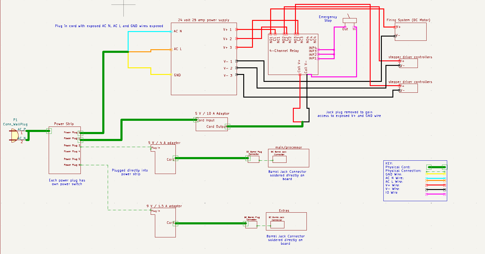
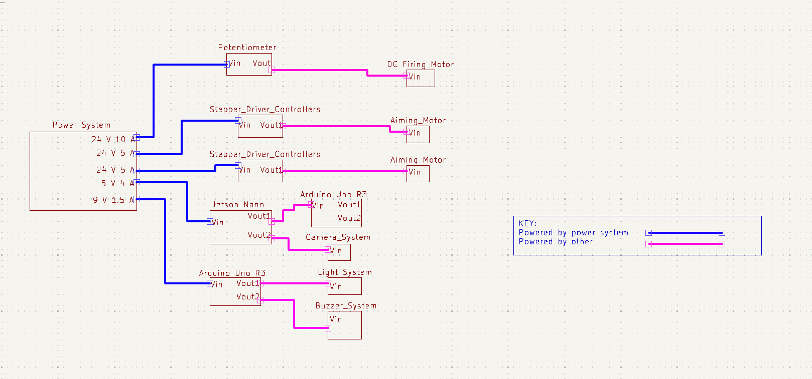

# Device Power Subsystem

**Function:**

Figure 1: Device Power Subsystem

The goal of this subsystem is to convert AC power from the wall outlet to DC power, and then distribute that power to the different device systems.  

**Constraints:**

| NO. | Constraint                                                          | Origin           |
|-----|---------------------------------------------------------------------|------------------|
| 1   | The power system shall be controlled by an emergency stop which will de-energize the mechanical system. This will shut off the motors which will not allow any projectiles to be fired. This will only be used if the system threatens peoples safety |Conceptual Design |
| 2   | The system shall convert 100-120 wall outlet AC voltage to 20 watts, which is required by the main/processor unit, 4.5 watts, which is required by the extra subsytem, 50 watts, which is required by the emergency stop system and a maximum of 480 Watts DC, which is required by the mechanical unit |Conceptual Design |
| 3   | The system shall be controlled by a power switch                 |Conceptual Design |

1 The power system shall be controlled by an emergency stop which will de-energize the mechanical system. This will shut off the motors which will not allow any projectiles to be fired. This will only be used if the system threatens peoples safety  [Conceptual Design]

One of the requirements in the rulebook, given to us by the customer, is that the interceptor needs to have an emergency stop that de-energizes the interceptor. This emergency stop will cut power from the AC-DC convertor for the mechanical system to the motors themselves which will de-energize the interceptor. This system will only be used as a last case option if the interceptor threatens peoples safety. 

2 The system shall convert 100-120 wall outlet AC voltage to 20 watts, which is required by the main/processor unit, 4.5 watts, which is required by the extra subsytem, 50 watts, which is required by the emergency stop system and a maximum of 480 Watts DC, which is required by the mechanical unit [Conceptual Design]

The overall system must be able to provide at least 554.5 watts. The processor of this system requires a power draw of 20 watts and will be powered by its on supply. The extra system requires a power draw of 4.5 watts and will be powered by its on supply. The emergency system requires a power draw of 50 watts and will be powered by its on supply. The mechanical unit will consist of one DC motor that will do the firing and two motor controllers that will operate on the aiming system. The total combined power draw of this system is at least 480 watts. 

3  The system shall be controlled by a power switch  [Conceptual Design]

The system will be controlled by an on/off switch. This switch will allow the wall power to be connected or disconnected from each system that this subsystem powers.  

## Buildable schematic 

*power subsystem buildable schematic*

*Entire project power schematic*

This is to show the power system is supplying power to everything it needs to power in order to accomplish everything this project is required to do. The power system will just supply power to three motors, the relay system, the processor and the extra system. Every other componet will be powered by another componet. 

## Analysis

| System        | Voltage    | Current   | Power       | 
|---------------|------------|-----------|-------------|
| Mechanical    | 24 Volts   | 20 Amps  | 480 Watts    |
| Extra | 9 Volts  | 500 mAmps | 4.5 Watts  |
| Processor     | 5 Volts    | 4 Amps    | 20 Watts    |
|Emergency      | 5 Volts    | 10 Amps   | 50 Watts    |
| Total         |  |     | 554.5 Watts |

The above table details the different power draws that is required from this system. 

### Mechanical:

This power system will supply power to three main componets of the mechanical system. These componets are the firing mechanism's DC motor, and two stepper driver controllers that will control the aiming of the interceptor. The DC motor has a maximum voltage requirement of 24 volts with an amperage draw of 10 amps. This means the power draw of this system will be:

DC Motor Power Draw: (24 volts) * (10 amps) = 240 watts

The two stepper driver controllers have a voltage requirment of 24 volts with an amprage draw between 0-5 amps. The amperage of these controllers depends on the amount of power the actual motors need, so this system must be able to produce the maximum current so the motors can recieve the maximum current if needed. This means the total power draw of both controllers will be:

Single Controller Power Draw: (24 volts) * (5 amps) = 120 watts

Total Controller Power Draw: (120 watts) + (120 watts) = 240 watts

This places the maximum power draw of the entire system at:

Total Power draw of the Mechanical System: (240 watts) + (240 watts) = 480 watts

To acomplish the total power draw required, this system will utilize a power supply capable of supplying 600 watts of power[4]. This will give the system plenty of head room in powering the three componets as it will supply 120 more watts then is required.

### Extra:

The extra system will be controlled by an Ardunio Uno R3. This Ardunio has a voltage requirement of 9 volts and a minimum amperage draw of 0.5 amps. This means the total power draw of this system will be:

Total Power draw of the Extra System: (9 volts) * (0.5 amps) = 4.5 watts

The buildable schematic shows this system will supply a 9 volt signal at 1.5 amps rather than 0.5 amps. This is becuase the Adaptor choosen [1] is built for this specfic Ardunio and the Ardunio itself is able to limit the current draw from this adaptor to the acceptable current load. 

### Processor:
The processor system will be controlled by a Jetson Nano developer kit. This Jetson Nano requires a voltage of 5 volts and an amperage draw of 4 amps. The total power draw of this system will then be:

(5 volts) * (4 amps) = 20 watts

To acomplish this power draw, the system will utilize an adaptor that was designed for this specfic Jetson Nano [2]. This adaptor supplys a voltage of 5 volts and a maximum current of 4 amps [2]. 

### Emergency Stop

In order for the emergency stop to properly de-energize the entire mechanical system, one switch must be able to operate on three seperate circuits. The way this system will accomplish this is through the use of a 4-channel relay componet. This four channel relay takes a 5 volt 10 amp input to charge the coil. This will be acomplished using a 5 volt 10 amp power supply [9]. This means the power draw of this system will be:

Total Power draw of the Emergency System: (5 volts) * (10 amps) = 50 watts

The three outputs of the 24 volt power supply will be connected to the three channel inputs of the relay and there connected outputs will connected to the NO (normally open) input. This will cause the 24 volt signal to output whenever the coil is not being connected to the 5 volt input. This is important as the emergency switch is supposed to shut power off when the switch is closed. Becuase of this when the emergency switch is closed the coil will begin charging causing the channel switch to close. This will output the NC (normally closed) signal, which will not be connected to the motors. [8][5]

### Total Power

To achieve everything this system is required to do, the total power draw of this system will be:

(480 watts) + (4.5 watts) + (20 watts) + (50 watts) = 554.5 watts

This will be accomplished by using four seperate power supplies. The first will supply a total of 600 watts and will power the Mechanical system [4]. The second will supply a total of 13.5 watts and will power the extra system [1]. The third will supply 50 watts and will power the emergency system that is connected to the mechanical system [9]. The final adaptor will supply 20 watts and will power the processor system [2]. The total power draw of these four supplies will be:

(600 watts) + (13.5 watts) + (20 watts) + (50 watts) = 683.5 watts

The total supplied power of 683.5 watts will completely encapsulate the required wattage of 554.5 watts, and will allow the system to function correctly and accurately.

### Power Switch 

To accomplish the power switch constraint this system will utilize a power strip. This power strip will have six seperate plug ins each with it's own power switch. This system will utilize four of the six plugs as there are four power supplies being used in this system. The power strip selected is rated for 1875 watts of power which will comfortably encapsulate the three supplies being utilzed as the maximum power draw for this system is 554.5 watts. [3]

## BOM
|Item Name | Description | Subsystems | Part Number | Manufacturer | Quantity | Price | Total |
|----------|-------------|------------|-------------|--------------|----------|-------|-------|
|CCCEI Metal Power Strip Individual Switches 6 Outlets | 6 plugin power strip with 6 switches | Mechanical, Extra, Processor | B08HYLW3GX | CCCEI | 1 | 16.99 | 16.99 |
|Emergency stop switch | Switch will cause the relay to disconnect the power to the Mechanical system | Mechanical | B079FKJG26 | API Electric | 1 | 9.99 | 26.98 |
|5V 4A Power Supply Adapter | Jetson Nano power supply rated for 5 volts and 4 amps | Processor | B07RTWD725 | COOLM | 1 | 13.68 | 40.66 |
|Gonine 9V DC Power Supply | Arduino Uno R3 power supply rated for 9 volts and 1.5 amps | Extra | B099J3JCVX | wei dian | 1 | 12.69 | 53.35 |
|ALITOVE DC 24V 25A 600W Power Supply | 600 watt power supply | Mechanical | B0786LMNR2 | MEISHILE | 1 | 31.99 | 85.34 |
|16 AWG wire | 16 AWG wire to hook up mechanical system | Mechanical | B07D73ZRDP | GS Power | 1 | 8.49 | 93.83 |
|AC power cord | Power cord that will connect the power strip and Mechanical power supply | Mechanical | B09VRLJD7J | LORDTRONICS | 1 | 6.99 | 100.82 |
| 2x2 Solderable bread board | Bread board that will connect the switch's outputs to three inputs of the relay | Mechanical | B0BSHG21P5 | SchmalzTech, LLC | 1 | 3. 49 | 104.31 |
| 5V 10A power Supply | Relay coil power supply | Mechanical | B0CJRZPJSY | Henxlco | 1 | 13.99 | 118.30 |
| 4-channel relay | Relay that will disconnect the power to the motors | Mechanical | B08PP8HXVD | ANMBEST | 1 | 12.99 | 131.29 |

## References 

[1] Amazon, https://www.amazon.com/Gonine-5-5x2-1mm-Positive-Connector-Elliptical/dp/B099J3JCVX/ref=sr_1_1_sspa?crid=PDOUNUYWJ2B9&dib=eyJ2IjoiMSJ9.DJoK0_iOF_aAvsQ3QTa63W7iStx7BwVycj7Q1kl-PXtBLvlEaBwqgG6gtWA8PbD0Pj3ScHu33EI9rB3q83JOwQOaTEeChCkqDVHIeSJvLMLoOfzRVe8galg447OFLraCADJLGRl8nRRVqM07tapisdxicN7Ti7NdJ2gpvM41qR_SDix9Tqm8iRB4G1L3mphy0nhB-nHj8vJP2KhA4ZPjADA87iALTsqvwnnskK2TbH3c4f8Ec2eN8c0EF80YXXX3q1geBsunN407VK1EZmhQxqc_HNy_UdLM57_ruaM_QUg.E6YjSVNYmqFjQegxH1kKLQZPtozE0ootNyhxLe2Ou2c&dib_tag=se&keywords=arduino+uno+r3+power+supply&qid=1713303820&s=electronics&sprefix=arduino+uno+r3+power+supply%2Celectronics%2C90&sr=1-1-spons&sp_csd=d2lkZ2V0TmFtZT1zcF9hdGY&psc=1 (accessed Apr. 16, 2024). 

[2] Amazon, https://www.amazon.com/5V-Power-Supply-Adapter-Universal/dp/B07RTWD725/ref=sr_1_1_sspa?crid=1OU1EJ4H7X9BT&dib=eyJ2IjoiMSJ9.sXmGimoCjSyPLAbJTSi1qaMPM7xYBu2pLDlTtzcteTO3oDI0TMAshqyQnxJYDEYHpUoCurrPArHwJW7kO2ipm9MmgS-NAF6OLQj48GTgYJYLTzAsKkSoX_MnvI4mQLLxzvl9vu_BY5mQ-JXqkI16cp6DiZRwXpRfrVIF96KMxyoA18KmddLYUZkxDVNXNKaUJaJo8UFwV7_Y1RUX_TlRKzGKPTkZSGDgxEZnbJcxl5svoI44vs7zIEWi-fPMpM7McsCO2mVNEIpRqAixbON8vHwa2b4EJ4yywpdkxMSQAjk.qAJk2VW_ASJKmJ1jde06lwT246mCHOzZ5rIuJDCZgWo&dib_tag=se&keywords=jetson%2Bnano%2Bpower%2Bsupply%2B5v%2B4a&qid=1713303744&s=electronics&sprefix=jetson%2Bnano%2Bpower%2Celectronics%2C82&sr=1-1-spons&sp_csd=d2lkZ2V0TmFtZT1zcF9hdGY&th=1 (accessed Apr. 16, 2024).  

[3] Amazon, https://www.amazon.com/Individual-Switches-Protector-Appliances-Extension/dp/B08HYLW3GX/ref=asc_df_B08HYLW3GX/?tag=hyprod-20&linkCode=df0&hvadid=647192999967&hvpos=&hvnetw=g&hvrand=12971397952727350175&hvpone=&hvptwo=&hvqmt=&hvdev=c&hvdvcmdl=&hvlocint=&hvlocphy=1025954&hvtargid=pla-2013978108223&mcid=3f30a49c0078360ebf82f79cd802428d&th=1 (accessed Apr. 16, 2024). 

[4] Amazon, https://www.amazon.com/Switching-%EF%BC%88SMPS%EF%BC%89Monitoring-Industrial-Transformer-220VAC-DC24V/dp/B0786LMNR2/ref=asc_df_B0786LMNR2/?tag=hyprod-20&linkCode=df0&hvadid=312128003944&hvpos=&hvnetw=g&hvrand=8859139017483582435&hvpone=&hvptwo=&hvqmt=&hvdev=c&hvdvcmdl=&hvlocint=&hvlocphy=1025954&hvtargid=pla-573585158574&psc=1&mcid=2000dd6590d83024ac5f590c09878b0f&gclid=Cj0KCQjw8pKxBhD_ARIsAPrG45kRdCWz99DhDEafjpnV7ArQy55SFNEh73GzbDIk_U8pW8H17HLCgPkaAkBvEALw_wcB (accessed Apr. 21, 2024). 

[5] APIELE 22mm NC red mushroom emergency stop push button switch 600V 10 amp XB2-01ZS: Amazon.com: Industrial & Scientific, https://www.amazon.com/a12082000ux0309-Mushroom-Emergency-Button-ZB2-BE102C/dp/B079FKJG26 (accessed Apr. 23, 2024). 

[6] Amazon, https://www.amazon.com/American-Aluminum-Primary-Amplifier-Available/dp/B07D73ZRDP/ref=sr_1_2_sspa?crid=H80LENUU6197&dib=eyJ2IjoiMSJ9.0LnrB1pSbZfctUIBZoggXpFtF6rNKA5WSjlZ1BAxa5VLNFYzVeSdHbTsxIQpBpOHzXC3YJbnzAa_KSkYleJmfalTRC9e7IBhriGkN5cIdJByBwJBxLefuZR3uARHY3WuPzhVAXu12tEcI4Wv8BbEOHL121_mpBof-J1BaaBkTpbt3_WxFslTWzDCWcemV1DMtBLuySWdO_Ky-T0tlHlHxXulC8i8DlvqhMharC0pRcQ-3uMR8DgiFz2wJZ-PH6kPn4uHzeBoAxzH3pkFlQdPqg6ym2pBhJvBym3UzcEjujM.eUjEa-tsRWWr0zni-ns4wD1nVYVzsPe6mKV8hno2oPM&dib_tag=se&keywords=16%2Bawg%2Bwire&qid=1713650740&refinements=p_36%3A-1000&rnid=1243644011&sprefix=16%2Bawg%2B%2Caps%2C90&sr=8-2-spons&sp_csd=d2lkZ2V0TmFtZT1zcF9hdGY&th=1 (accessed Apr. 20, 2024). 

[7] Amazon, https://www.amazon.com/Bergen-Industries-Inc-PS613163-Appliance/dp/B07C9D6CXY/ref=pd_bxgy_d_sccl_1/136-1250652-4143303?pd_rd_w=FTiWP&content-id=amzn1.sym.2b132e63-5dcd-4ba1-be9f-9e044543d59f&pf_rd_p=2b132e63-5dcd-4ba1-be9f-9e044543d59f&pf_rd_r=G8JXM35373BJ3AMGBE8N&pd_rd_wg=ocuCJ&pd_rd_r=83d5ef2c-44e7-47a2-9db3-9f26b09cc7f7&pd_rd_i=B07C9D6CXY&th=1 (accessed Apr. 22, 2024). 

[8] Amazon, https://www.amazon.com/dp/B08PP8HXVD/ref=sspa_dk_hqp_detail_aax_0?sp_csd=d2lkZ2V0TmFtZT1zcF9ocXBfc2hhcmVk&th=1 (accessed Apr. 22, 2024). 

[9] Amazon.com: Henxlco AC100-240V to DC 5V 10A 50W power supply adapter converter transformer with 5.5 x 2.5mm plug for led strip light，cctv security camera system : Electronics, https://www.amazon.com/Henxlco-AC100-240V-Converter-Transformer-Light%EF%BC%8CCCTV/dp/B0CJRZPJSY (accessed Apr. 23, 2024). 

[10] Schmalztech double sided Enig protoboard, solderable breadboard, electronic circuit board for DIY prototype circuit, FR4, plated through Hole Solder Prototype Board, St-Proto (1" x 2"): Amazon.com: Industrial & Scientific, https://www.amazon.com/SchmalzTech-Protoboard-Solderable-Breadboard-Electronic/dp/B0C3YYG6CV (accessed Apr. 23, 2024). 

[11] “Top Embedded Institute in Bangalore,” IIES, https://iies.in/blog/how-to-use-relay-module-without-arduino/#:~:text=To%20use%20a%20relay%20module,and%20the%20number%20of%20channels (accessed Apr. 22, 2024). 
