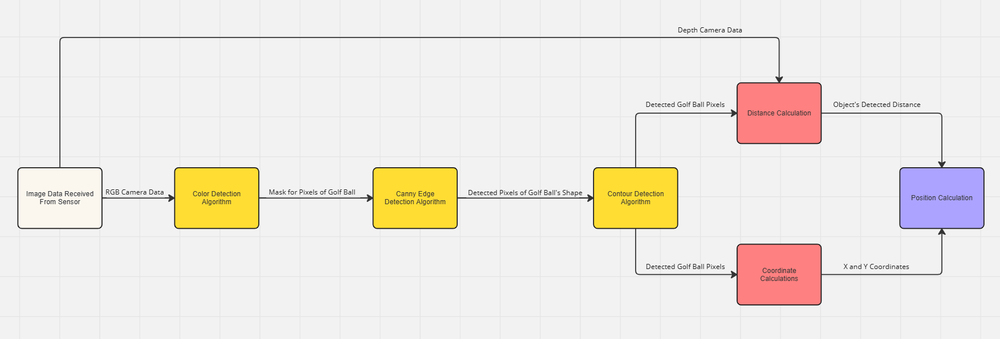
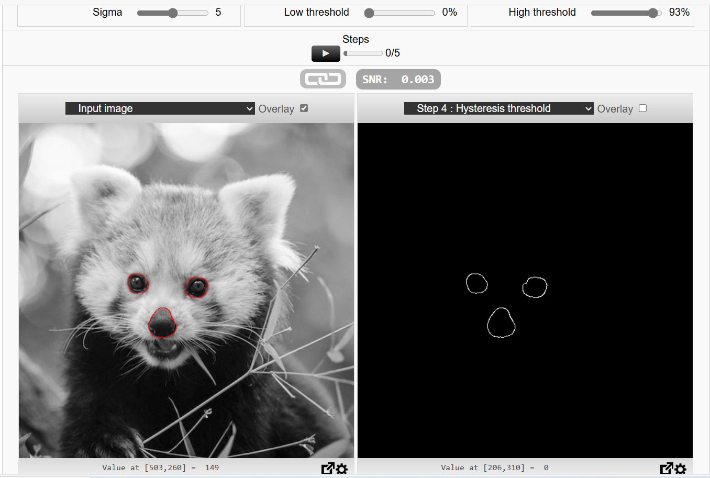
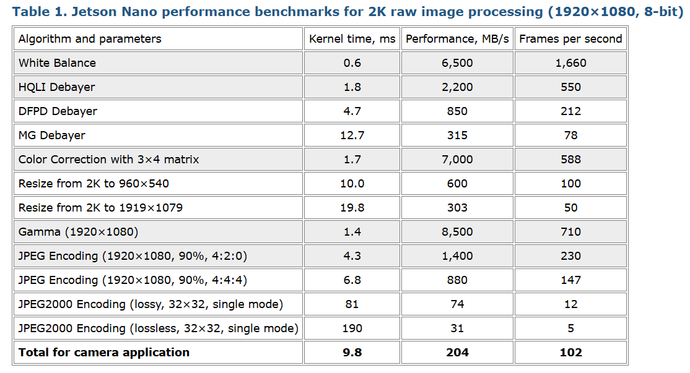

# Image Processing Subsystem

**Function:**

The goal of this subsystem is to receive and process the data from the camera sensor to determine the position and speed of the practice golf ball.  

**Constraints:**

| NO. | Constraint                                                          | Origin           |
|-----|---------------------------------------------------------------------|------------------|
| 1| Must be able to distinguish the golf ball from surroundings based on golf ball's shape and color | System Requirement|
| 2| Must be able to extract the x,y coordinates of the golf ball with an inch of accuracy to distinguish between the wires and variable height| System Requirement|
| 3| Must be able to receive the data and perform calculations in 500 ms to allow the interceptor time to aim and shoot based on the calculations| System Requirement|

1. In order for the system to properly detect the golf ball and extract the necessary information for aiming, the system needs to distinguish the golf ball
   from the rest of the image. Then, edge and contour detection techniques will be used to find the golf ball based on it's round shape.
2. The position of the wires are four inches apart from six feet away. Because of this, the error cannot be two inches because if it is in between two
   wires, there is no way to know if it is two inches to the right or left. However, if the error is one inch to the right or left of a wire, it will still
   be closest to the wire it is on. All pixels need to have the same error. Since the two heights are seven inches apart, the wire positions are the
   constricting factor. The ball has to be detected as soon as it is released for the interceptor to have enough time to launch the projectile. Thus, one
   inch of error is allowed for the detection of the golf ball. 
3. The fastest speed of the golf ball is 1.95 seconds based on empirical data from the customer. The ball needs to be detected in enough time for the
   launcher to aim and launch the projectile. This minimum allows time for the motors to make adjustments and fire after the information has been received
   and interpreted which is expected to take half a second each. It also allows the speed calculation to take 250 ms as well.

**Buildable Schematic**

The system is purely software. Any connections for the processor should be shown in that subsystems schematic.

A flow chart of the code is given below.

This shows the steps for each major calculation and what is necessary for each calculation. This process will be done twice to receive two positions for the
speed calculation done by the processor.

**Analysis:**

*Detection*

The golf ball will have a unique color and shape combination that will allow the object to be detected. Using color since the white golf ball can be
distinguished from other white objects while keeping its shape intact. This can be done using hue, saturation, and variation color detection. The 
boundaries for the color are determined and entered in as limits for each of these values. These parameters and the image are then sent to a function 
called inRange. This will apply a mask to the array of pixels representing the image with a mask to determine the objects with the color. The results of 
such operations and algorithms can be seen below to detect a light color like grey.

This can be adjusted to detect a white ball by adjusting the saturation parameters for the color detection. The algorithm's parameters for the
intensity of the color can also be adjusted. The Big O analysis of this function would be O(n) because it is an iterative function that will go through all
of the pixels provided [1].

Once the golf ball has been detected based on color, the pixels representing the color can have an edge detection algorithm applied to it. With the
contrast from the added lighting that will be implemented, the features of the golf ball will be distinct from any other pixels not representing the golf
ball in the color detection results, similar to how the grey triangle on the game cartridge is still distinguishable in the picture above. The canny edge
detection would be best suited for this since it not only filters our non-edges but also sets edges as weak and strong. The golf ball will have very
strong, round edges making it highly detectable by the algorithm. The adjustable ranges to define an edge used by the open sources cv function also make it
ideal. The results of calibrated canny edge algorithms can be seen below [2].

The Big O analysis of this function would also be O(n) since it is an iterative function through the pixels to determine if it has the qualities of an
edge. This function is most effective when the image has been cleaned and processed which is another O(n) analysis.

The exact accuracy depends on the characteristics of the golf ball and how they are picked up by the camera as well as the environment the golf ball is in.
The parameters of both these algorithms can be precisely calibrated for the given object as seen in the images from other people’s experiments and several
simulation tools available. Using these tools, I was able to simulate finding small, round objects in a picture. The results can be seen below.

Results of altering the thresholds for detection can be seen below for finding more perfectly round objects which can be seen below.

Finally, the thresholds can even be altered to distinguish between slight differences in the exact edges and contours of the image which can be seen below
[3].

Because of this accuracy with thresholds and parameters and the preserved shapes from color detection, the golf ball should be able to be detected and
recognized by the camera via these image processing techniques.

*Distance and Coordinates*

The distance of the object can be found using another iterative function for another linear algorithm. The camera returns an array with the depth of each 
pixel. This array is compared with the array holding the pixels that represent the golf ball. The result is the depth of each pixel of the golf ball.

The object's coordinates can be determined through comparisons. Each pixel will appear to be a certain width and height. The results of the detection 
algorithm can be used to only determine the dimensions of each pixel of the object. The pixel width and height representation can be found with the 
following equations:

FOV width = 2 * tan(FOV/2) * distance and FOV height = 2 * tan(FOV/2) * distance

width per pixel = FOV width/horizontal resolution and height per pixel = FOV height/vertical resolution

The distance determination will be used to fill in the distance variable in the equation. For the distance of six feet the result will be

FOV width = 2 * tan(69/2) * 6 = 8.25 feet and FOV height = 2 * tan(42/2) * 6 = 4.61 feet

width per pixel = 8.25/1920 = 0.004296 feet/pixel * 12 = 0.05155 inches/pixel

height per pixel = 4.61/1080 * 12 = 0.004265 feet/pixel = 0.05118 inches/pixel

The amount of inches for the width and height represented by the pixels can be used to find out the x and y coordinates by multiplying the pixels by the
numbers provided [4 & 5]. The x and y coordinates can then be found by determining the pixel's coordinate in the image based on the array value of the
pixel from the original image. Then, use the calculated pixel representation to multiple the image coordinate with the real world representation. This 
should provide the real world x and y coordinates of the object. At six feet, the golf ball will only be represented by 36 pixels. Six feet is the maximum
distance the golf ball will be from the camera, so the one inch of error will be achievable. There is a 19 pixel buffer for motion blur and pixels blurring
together. Using the standard margin of error equation in statistics 

ME = Z * σ/square root of n 

where Z is the typical confidence interval of 1.96, σ is the highest filter value for the algorithm, which has been set in simulations as 10, and n is the
number of frames which will be one. Plugging these values in gives this result

ME = 1.96 * 10/1 = 19.6 pixels 

for the pixel measurements this is

0.05118 * 19.6 = 1.00 inches for the height and 0.05155 * 19.6 = 1.01 inches for the width

Lower sigma values also detect smaller objects more accurately, so the actual error is expected to be much lower. This combined with taking all the pixel
locations and averaging them together will provide a one inch accuracy for the golf ball's position. These calculations are basic arithmetic and should be
O(1). Counting the pixels is another O(n) operation, but the n number of pixels is significantly smaller due to the altered array from detecting the object.

*Speed*

The camera that is being used is 1920 by 1080 pixels. Benchmarks for the Jetson Nano Developer Kit show that for a 1920 by 1080 pixel image can resize
images in 10 ms [7]. 

This is an iterative process with O(n) time so it can be assumed other iterative processes with similar computation complexities will
have the same runtime. The function for color detections, applying Gaussain blur, assigning an edge value to each pixel, and finding the contours are all
iterative. The computations needed for each of this functions are also pretty similar to each other and the resize algorithm used in the benchmarks above.
The higher resolution resize is more computationally intensive, so it's runtime will be used. Each will run for 19.8 ms for a total of 79.2 ms to detect
the golf ball. The camera takes in 30 frames per second so it takes 33.33 ms to get a new image. The USB cord connecting the processor and camera processes
data at 5 Gbs. Each pixel is 8 bits and has 2 color representation bytes so the total is 

8 * 2 * 1080 * 1920 = 0.03318 Gb. 

Taking the amount of data over the rate of transfer gives 

0.03318 Gb/5 Gbs = 6.64 ms. 

The arithmetic processes for determining acceleration, speed, and other calculations to send to the launcher are considered to have O(1). This means the
most limiting time factor is how long it takes to get three positions. 

33.33 ms + 6.64 ms + 79.2 ms + 33.33 ms + 6.64 ms + 79.2 ms + 33.33 ms + 6.64 ms + 79.2 ms = 357.42 ms. 

This time period is well within the almost 1/8 time of the ball's travel given for the data to be collected and processed for the aiming and launching. It
gives nearly 7/8 of the remaining time to determine the speed and location of the ball which will then be used to aim and intercept the ball. After the
estimated 500 ms to process the image and calculate the speed and half a second each to aim and launch, 400 ms is left for the projectile to travel and
intercept the golf ball before it hits the interceptor.

**Bill of Materials:**

This subsystem is implemented as part of the processor. All camera and lighting information is part of the sensor. No additional parts needed.

**References:**

[1] A. Rosebrock, “OpenCV and python color detection,” PyImageSearch, https://pyimagesearch.com/2014/08/04/opencv-python-color-detection/ 
(accessed Apr. 15, 2024). 

[2] C. Writer, “Edge detection in image processing: An introduction,” Roboflow Blog, https://blog.roboflow.com/edge-detection/ (accessed Jun. 29, 2024). 

[3] “Big | image processing online demonstration | canny edge detector,” Image Web Demonstrations, https://bigwww.epfl.ch/demo/ip/demos/edgeDetector/ (accessed Jul. 14, 2024). 

[4] R. Awati, “What is field of view (FOV)?,” WhatIs, https://www.techtarget.com/whatis/definition/field-of-view-FOV (accessed Apr. 20, 2024). 

[5] “Understanding image quality on the MV32,” Cisco Meraki Documentation,
https://documentation.meraki.com/MV/Viewing_Video/Understanding_Image_Quality_on_the_MV32 (accessed Apr. 20, 2024). 

[6] “How to measure pixel size for image processing? | Researchgate,” ResearchGate,
https://www.researchgate.net/post/How_to_measure_pixel_size_for_image_processing (accessed Apr. 20, 2024). 

[7] F. Serzhenko, “✅ Jetson nano benchmarks for image processing,” fastcompression.com - GPU Image Processing Software,
https://www.fastcompression.com/blog/jetson-nano-benchmarks-image-processing.htm (accessed Apr. 15, 2024). 
