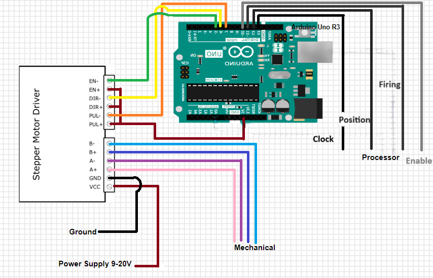
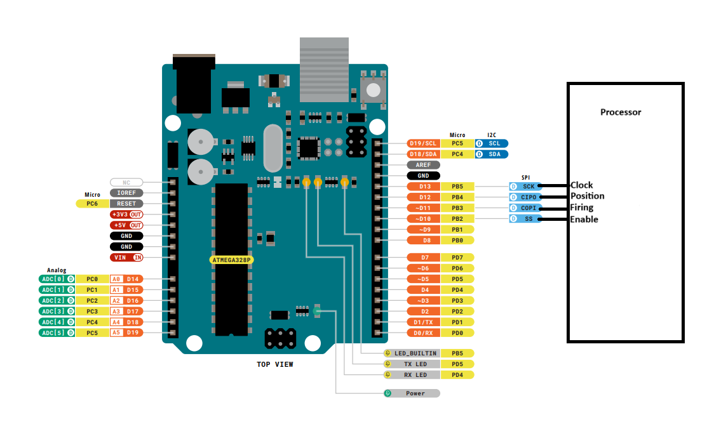

# Interceptor Controller Subsystem

## **Function:**

Figure 1: Interceptor Controller Subsystem

The goal of this subsystem is to activate the position motors and firing mechanism within the mechanical system, maintain safe firing speed, as well as alleviate some of the coding within the processor. 

## **Constraints:**

|No.|Constraint|Origin|
|--|------|-------|
|1|The Interceptor Controller shall move firing mechanism to 1 of 30 pre set locations |Conceptual Design|
|2|Must communicate with processor| Conceptual Design |
|3|Shall receive 5V power supply from processor| Conceptual Design|
|4|Must change direction of the motors in the Mechanical's section |Conceptual Design|
|5|Must maintain safe firing speed and distance|Conceptual Design/Rule Book|
|6|Must change position before incoming object enters the "kill zone"| Conceptual Design|

1.	Using the sensor data analyzed by the processor the arduino activates the 2 position motors to move to 1 of 30 set positions.
2.	After completing the movement to the desired position, and the projectile is within set "kill zone", the firing mechanism is engaged firing only one shot.
3.	Using the 5V pin on the processor to power the adruino.
4.  To be able to move to the correct coordinates the motors need to move in either direction along the x and y axis.
5.  Per Devcom rule books the projectile must be fired at a safe speed and stay within a distance of 6ft *this speed will be found by the ME team*
6.  Based off calculations made with the dimensions of the game board it will take the projectile approximately 1.95 seconds to 7.4 seconds to travel down the line given the two different height points. However, after subtracting the worst-case scenario with sensing, processing, and travel time this leaves 1.6 seconds for the firing mechanism to move into position and fire at the object before collision.

## **Buildable Schematics:**

Figure 2: Buildable Schematic

## **Analysis:**

Stepper Motor Integration:

The stepper motor driver converts a pulse signal into a precise position and can also make the rotation of the motor bidirectional. With this function and the orientation of the motors we are able to create an x and y axis for the firing mechanism to move on. This allows 30 set coordinates to be programmed for possible incoming attacks. This component was pick by the Mechanical Engineering portion of our team, however, it is important to this subsystem because of its direct integration within the Arduino. Through GPIO communication, as stated above, the Arduino UNO R3 commands the stepper motor driver to adjust the interceptor's position, aligning it with the golf ball's predicted path. Real-time trajectory data calculated by the processor is sent to the Arduino that will guide its precise motor movements, ensuring accurate interception. After firing is completed the stepper motor will be put back into a zero position. While it is in its zero position, the processor can count how many steps the motor takes to determine the correct aiming position [6].

Arduino Intergration:

*Motor Integration*

As stated before the stepper motor drive given was picked by the ME team. This component was picked through testing and consideration of use by them. The Arduino UNO R3 seamlessly integrates with the TB6600 Stepper Motor Driver to control the interceptor's aiming mechanism [7]. With that being said an Arduino was picked to be used within this subsystem to control the driver. Through research it is found to be the most commonly used device to pair with the stepper motor driver and with a large data base of research, experiments, and recommendations. This also allows the team to alleviate some of the coding within the processor making it easier to trouble shoot problems, breaks up coding assignments, and allows for specific testing with the ME team to fine tune the speed and positions.The arduino will need to set the motors to move between 200 and 600 RPMs [9] to allow ample time for firing. At 200 RPMs it allows 3 full rotations per second, however, the position only has a range of 180 degrees so this makes it 6 half rotations per second. If we find this is not quick enough through testing we can at max triple this making it 18 half rotations per second. The motor used for the firing mechanism runs at 10,000 RMPs and will be plenty fast enough to hit the object in time. 

*Processor Integration*

The arduino will also be communicating with the processors Jetson Nano through the SPI pins. Pin D13 (SPI serial clock output) will be used as the clock between the two. Pin D12 (SPI Main In Secondary Out) will allow the processor to send data to the arduino as to which line the projectile is coming from. The arduino will then determine which of the 30 positions it is and initiate the position motors to move accordingly. Pin D11 (SPI1 Main Out Secondary In) after the position is in place a signal will be sent for a ready fire and then will load the ammunition into the barrel and fire. After this the mechanism will return to "zero position" or starting state and is ready for the next target. Pin D10 will be used as the Enable pin.

Figure 3[1]

## **Bill of Materials:**

|Device|Description|Used in which subsystem|Part Number| Manufacturer|Quantity|Price|Total|
|-------|---|---------|-------------|----|----|----|----|
| Arduino UNO R3 |converts analog data to digital inputs to move motors|Interceptor Controller Subsystem|A000066| Arduino|2|$27.60|$55.20|
|TB6600 Stepper Motor Driver|Regulates current and keeps from going reverse bias, and divides rotation into equal steps|Interceptor Controller Subsystem & Mechanical Subsystem|TB6600|DFRobot|0||purchased by ME team|
| | | | | | |Final Total|$55.20|

## **References:**
[1] Arduino, https://docs.arduino.cc/resources/pinouts/A000066-full-pinout.pdf (accessed Apr. 17, 2024). 

[2] Arduino, https://docs.arduino.cc/resources/schematics/A000066-schematics.pdf (accessed Apr. 17, 2024). 

[3] Arduino, https://docs.arduino.cc/resources/datasheets/A000066-datasheet.pdf (accessed Apr. 17, 2024). 

[4] Admin, Technology tutorials, https://toptechboy.com/arduino-tutorial-37-understanding-how-to-control-dc-motors-in-projects/ (accessed Apr. 17, 2024). 

[5] R. Sawkare, “Arduino Uno R3 with l293d motor driver,” Medium, https://vayuyaan.medium.com/arduino-uno-r3-with-l293d-motor-driver-550c4a65f612 (accessed Apr. 17, 2024). 

[6] “TB6600 Stepper Motor Driver,” Bulkman, https://bulkman3d.com/wp-content/uploads/2019/06/TB6600-Stepper-Motor-Driver-BM3D-v1.1.pdf (accessed Apr. 8, 2024).

[7] “TB6600 Stepper Motor Driver,” DFRobot, https://www.dfrobot.com/product-1547.html (accessed Apr. 8, 2024).

[8] S. Hall, Devcom. Devcom, 2024. S31 Paper Wad Interceptor Challenge 2024, Rulebook, (accessed Apr. 8, 2024).

[9] K. Godiyal, “Guide to nema 17 Stepper Motor Dimensions, wiring pinout,” eTechnophiles, https://www.etechnophiles.com/guide-to-nema-17-stepper-motor-dimensions-wiring-pinout/#:~:text=The%20maximum%20speed%20at%20which%20an%20open-loop%20NEMA,this%2C%20the%20recommended%20speed%20range%20is%20200-700%20RPM. (accessed Sep. 2, 2024). 
