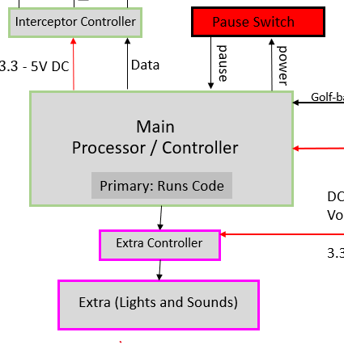
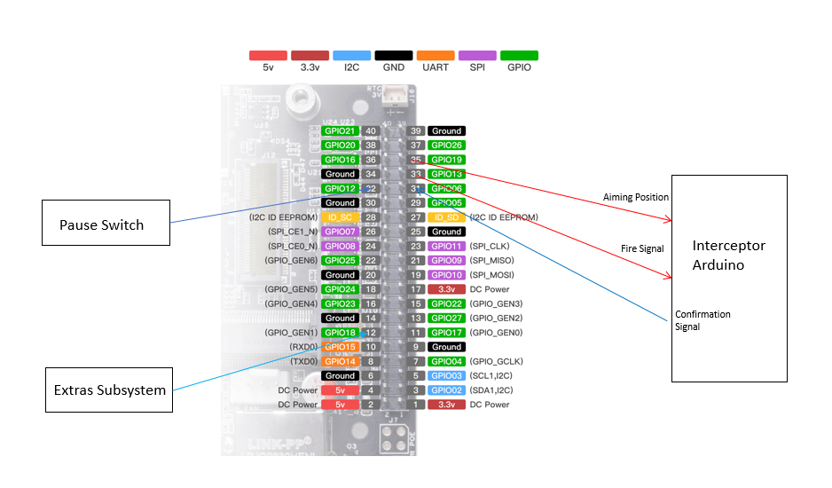

# **Function:**

*Figure 1: Main Processor Overview*

The main processor unit is responsible for receiving, analyzing, and interpreting data from the image-detecting system to calculate and aim the interceptor. Its primary function revolves around processing data related to a golf ball's trajectory in real time. The Jetson Nano serves as the brain of the system, consolidating data from the local camera that passes the data to the main processor.

## **Constraints:**

| NO. |	Constraint | Origin |
|-----|------------|--------|
| 1	| Time Constraints - Real-time data processing for trajectory prediction for the golf ball can take around 40 ms for each image. The main processor needs to calculate the ball data before the ball reaches the end which varies from 1.9 seconds to 7.4 seconds | System Constraint |
| 2	| Processing Speed - The main processor scripts and programs have to be optimized for efficient calculations. The scripts get the speed, wire, and variable height from input data. These calculations should not take longer than 40 ms per calculation iteration | System Constraint |
| 3	| Resource Utilization - Since the board has 1.43GHz with quad-cores and 4GB RAM, the main processor needs to be utilized properly to prevent an overload of system resources. The system needs to use all cores and not overload the RAM for speed efficiency but not sacrifice stability | System Constraint |
| 4 | Pausing Processes: The system needs a pause state to stop other scripts from activating firing mechanisms. | Rulebook |

## **Fulfilling Constraints:**

**Time Constraints:** The Jetson Nano has a worst-case scenario of 1.9 seconds to find the golf ball and calculate and aim the interceptor's position before the ball reaches the end, given by Devcom. Real-time processing of sensor data and trajectory calculations impose time constraints on the Jetson Nano. Since it has to be able to detect and calculate the proper position of the ball. Its 1.43GHz quad-core ARM Cortex-A57 processor needs to be able to receive, process, calculate the interceptor’s path, and aim the interceptor before the golf ball gets too far down the string [3]. The ball's travel time varies from 1.9 seconds to 7.4 seconds and the programs and data transmission needs to be optimized for an accurate and efficient system to be able to run fast enough. Delays in data acquisition, processing, or interceptor firing may affect the interception accuracy dramatically [2].

**Processing Speed:** The data gathered and calculated from the image processing is the worst case of 357.42ms from the image processing subsystem. The Jetson Nano needs to calculate and simultaneously send data to the firing mechanism Arduino. These tasks may strain the processing capabilities of the Jetson Nano, potentially leading to performance bottlenecks. The algorithms need to utilize the hardware and run scripts on multi-core to limit any speed limitations. Based on benchmarks used in image processing to find the position of the goldball will take 1.8ms for the moment calculations and 10ms for the centroid calculation [9]. This will give the X, and Y coordinates of the center of the goofball--giving the position of the golfball.

**Resource Utilization:** With a limited 4GB of LPDDR4 RAM, the Jetson Nano needs to use the resources but with image processing, it could easily have a resource overload. The memory and CPU load cannot be overloaded or the system's responsiveness will hinder its operation [2].

**Pausing Processes:** The rulebook from Devcom states the requirement for a pause switch integrated with the interceptor to stop the machine from firing. The constraint is pausing the script or scripts from running and operating as it is intended when the switch is on [9].

# **Buildable Schematic:**

*Figure 2: Jetson Nano Wiring Schematic*

## **Analysis of Using Jetson Nano:**

Python remains the primary programming language for interfacing with the Jetson Nano due to its versatility and extensive libraries. Additionally, C++ may be employed for computationally intensive tasks, leveraging the Jetson Nano's GPU for accelerated computations. [5]

**Hardware Configuration:** The Jetson Nano interfaces with the other hardware components with the GPIO pins. GPIO pins such as GPIO05, GPIO06, GPIO13, GPIO12, and GPIO18 facilitate flexible input/output operations, accommodating sensor connections and interceptor control. While using GPIO02 and GPIO03 for the SCL and SDA data [3].

**Programs and Tasks:** Custom Python scripts control various system tasks, including signal processing, trajectory calculations, and interceptor control. Multithreading may be applied to enable concurrent execution of tasks, maximizing system efficiency.

**Data Processing and Calculations:** Upon receiving the image detection data, the Jetson Nano executes trajectory calculations to determine the golf ball's velocity, height, distance, and direction. Mathematical algorithms will be used to accurately determine the data.

The height calculations will need the height of the camera, the image height of the bounding box in pixels, and the physical height of the two possible positions [1]. The given information from the image processing will be the given X-Axis and Y-Axis that will be used to determine the object height. Since the ball ranges from 43 inches to 50 inches in height, the system can figure out the wire the ball is on and the height the ball will be on.
~~~math
Object Height = ( Physical Height * Y-Axis )/( Image Height ) + Ball Offset
~~~
Test data from input from image processing axis data:
~~~math
Object Height = (4 inches * 730 pixels ) / ( 1080 pixels) + 42 inches
~~~
~~~math
= (2,920 pixel inches)/(1080 pixels) + 42 inches = 44.7 inches
~~~

The Speed calculations will be taking the distance or position of the object over time [1]. The frames of the objects location can calculate the speed using the following equation. The speed calculations will be determined using different distances and time frames sent from the image detection to determine how fast the ball is traveling. There will be 119.17ms between each retrieval of position, which will allow the calculation of speed. While using backlogged data of testing speeds, the system will also figure out speeds and compare to increase the overall accuracy of the speed [1].
~~~math
Speed = (DistanceOne - DistanceTwo) / Change in Time Between Frames
~~~

Test data from input from image processing distance data:
~~~math
Speed = (53 inches - 48 inches) / (0.1692 seconds)
~~~
~~~math
= (5 inches)/(0.1692 seconds) = 29.55 inches/second
~~~

**Control of Golf Ball Interceptor Shooter:** Based on the calculated trajectory data, the Jetson Nano will control the timing and activation of the golf ball interceptor shooting mechanism. It needs to have the interceptor to be properly aligned towards the golf ball's predicted path, and fire at the appropriate time to hit the ball mid-air. The Jetson Nano will send all the required data of the x-axis, y-axis, and firing signals to the arduino controlling the interceptor. This could use preset fire positions to optimize the interception process [6,7].

## **Analysis of Board Component Integration:**

**Pause Switch Analysis**

When the switch gives a positive 5 Volts to the Jetson Nano, we need to stop scripts from enabling the interceptor firing mechanism to halt any inappropriate firing. This adds a safety measure that the rulebook was requesting [9].

**Arduino Integration**

The Jetson Nano will integrate with the interceptor's Arduino controller aiming mechanism [7]. Through GPIO communication, the Jetson Nano commands the Arduino  to adjust the interceptor's position, aligning it with the golf ball's predicted path.

Real-time trajectory data calculated by the Jetson Nano will then wait for the Arduino to send back a confirmation signal to confirm the position of the interceptor. This can apply to the X-Axis and Y-Axis of the system to be able to know if the interceptor controller aimed to the correct position [6].

A second Arduino will control all the extras will send signals when aiming, and possibly firing signals for the extra subsystem that controls the sounds and lights.

## **BOM:**
| Name | Description | Used in which subsystem(s) | Part Number | Manufacturer | Quantity |	Price |	Total |
|------|-------------|----------|-------|-------|----------------------------|-------------|--------------|
|Jetson Nano Developer Kit | This component is meant to process incoming data and find the aiming position and firing time for the interceptor | Main Processor, Image Processing | 945-13450-0000-000 | NVIDIA | 	1 |	$229.38|	$229.38 |
| Total |            |                            |             |              |           |      | 			$229.38|

The Jetson Nano offers an affordable yet powerful solution for system control, priced at $229.38 [4]. This ensures cost-effectiveness without compromising performance for doing image processing calculations.

## **References:**

[1] N. shukla, “A review on image based target distance & height ...,” Research Publish, https://www.researchpublish.com/upload/book/A Review on Image Based Target Distance-1172.pdf (accessed Apr. 11, 2024). 

[2] “NVIDIA® Jetson Nano 4GB development kit,” OKdo, https://www.okdo.com/us/p/nvidia-jetson-nano-4gb-development-kit/ (accessed Apr. 11, 2024).

[3] “Jetson nano developer kit by Nvidia: 945-13450-0000-000,” Arrow.com, https://www.arrow.com/en/products/945-13450-0000-000/nvidia (accessed Apr. 11, 2024).

[4] Walmart, https://www.walmart.com/ip/NVIDIA-Jetson-Nano-Developer-Kit/480691437?wmlspartner=wlpa&selectedSellerId=11832&adid=22222222227480691437_11832_146045225401_18612869729&wl0=&wl1=g&wl2=c&wl3=628562918858&wl4=aud-2225087348107%3Apla-1838654855916&wl5=1025954&wl6=&wl7=&wl8=&wl9=pla&wl10=117079748&wl11=online&wl12=480691437_11832&veh=sem&gad_source=1&gclid=Cj0KCQjwlN6wBhCcARIsAKZvD5jwTYJgdMQqUTOA0_bi87XId5dExtSr0RrJbe0Hu2oBk9rWw8MvXPMaAoahEALw_wcB (accessed Apr. 11, 2024).

[5] Dr. M. Nazeer, M. Qayyum, and A. Ahad, “Real time object detection and recognition in machine learning using Jetson Nano,” SSRN, https://papers.ssrn.com/sol3/papers.cfm?abstract_id=4286087 (accessed Apr. 11, 2024). 

[6] “Five steps to connect Jetson Nano and Arduino,” Rareschool, https://blog.rareschool.com/2019/05/five-steps-to-connect-jetson-nano-and.html (accessed Apr. 17, 2024).

[7] “Connecting Jetson Nano to Arduino Uno,” NVIDIA, https://forums.developer.nvidia.com/t/connecting-jetson-nano-to-arduino-uno/172775 (accessed Apr. 17, 2024).

[8] “Toggle switches,” NTE Electronics, https://www.nteinc.com/switches/pdf/toggle-std.pdf (accessed Apr. 6, 2024).

[9] K. Bapat, “Find center of a Blob (centroid) using opencv (c++/python),” LearnOpenCV, https://learnopencv.com/find-center-of-blob-centroid-using-opencv-cpp-python/ (accessed Aug. 27, 2024). 

[9] S. Hall, Devcom. Devcom, 2024. S31 Paper Wad Interceptor Challenge 2024, Rulebook, (accessed Apr. 8, 2024).
