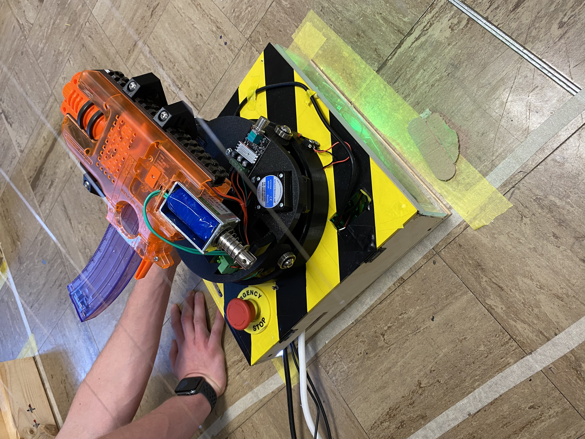
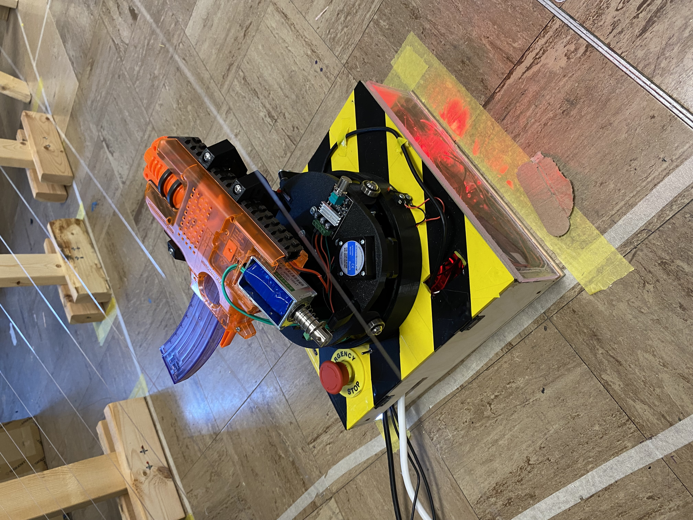
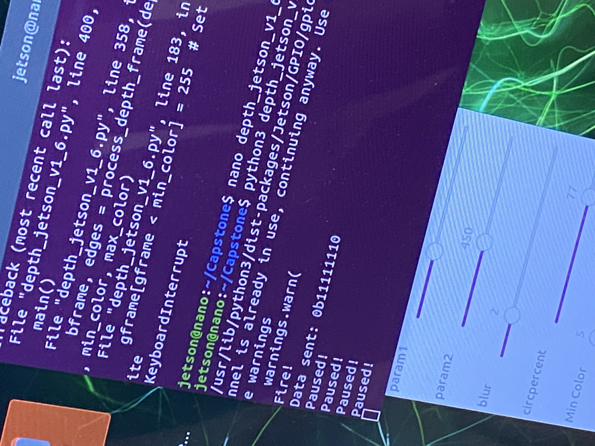
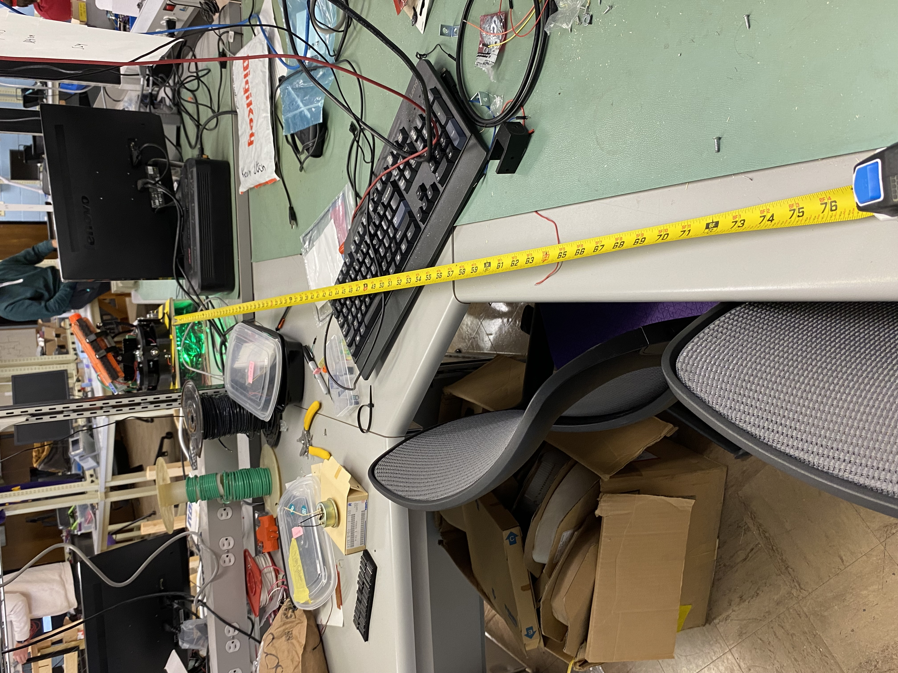
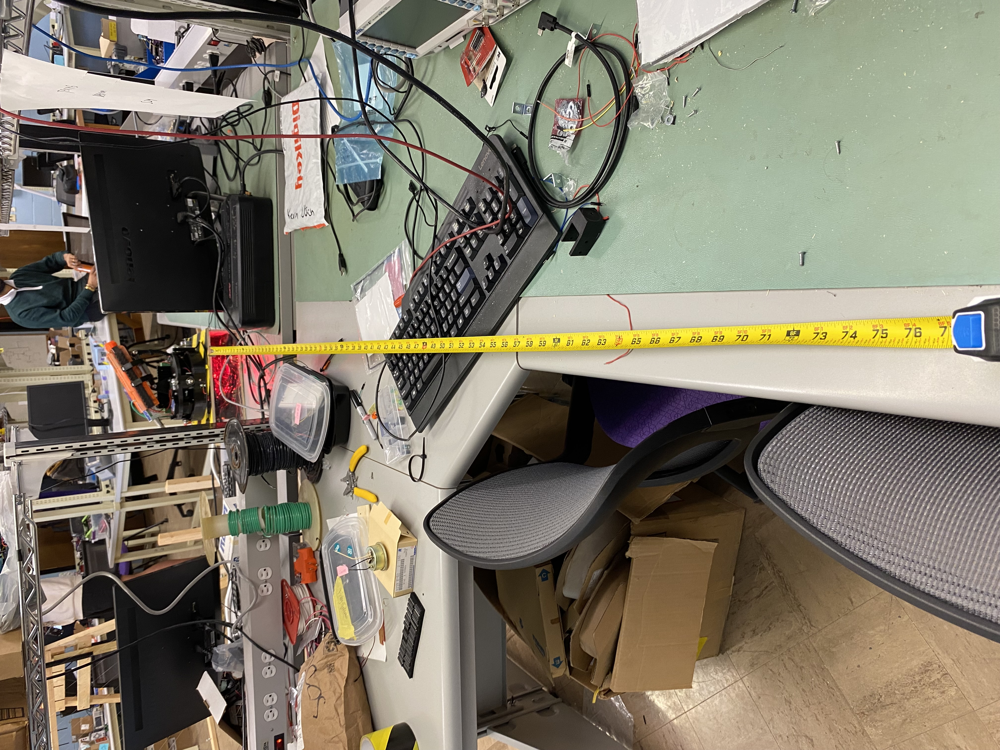

# Experimental Analysis

## Introduction 
The purpose of this report is to verify the requirements and constraints set for each subsystem and explain the prodecures and experiments used to validate them. The constraints for each subsystem were set and finialzed during the detail design phase of our senior design project. 

## Experimentation
Each subsystem will be divided into it's own section to make it easy to follow.

### Device Power

#### Constraints
| NO. | Constraint                                                          |
|-----|---------------------------------------------------------------------|
| 1   | The power system shall be controlled by an emergency stop which will de-energize the mechanical system. This will shut off the motors which will not allow any projectiles to be fired. This will only be used if the system threatens peoples safety 
| 2   | The system shall convert wall outlet AC voltage to up to 24 volts at up to 20 amps for the mechanical system. This includes two DC motor controllers which requires 9-48 volts at 5 amps and the DC motor which will receieve anywhere from 12-24 volts at 10 amps |
| 3   | The system shall convert wall outlet AC voltage to up to 5 volts at up to 5 amps for the proccesor system, which requires 5 volts at 4 amps, relay coil which requires 5 volts as a high impendence input and the extra subsystem which requires 5 volts at 0.8 amps. |
| 4   | The system shall be controlled by a power switch                 |

#### Results

#### 1 - Emergency Stop:

#### 4 – Power Switch 

The system must have a functioning power switch that turns the system on/off. For this system there are two switches. One that controls the mechanical system and one that controls the processor and light system. To test this, both switches were turned off and then on again to see if both successfully turn off and then on again. The results are listed below. 

| Trail Number | Mechanical Off | Mechanical On | Processor Off | Processor On |  
|-----------------|---------------------|--------------------|-------------------|------------------| 
| 1 | Yes | Yes | Yes | Yes | 
| 2 | Yes | Yes | Yes | Yes | 
| 3 | Yes | Yes | Yes | Yes |  
| 4 | Yes | Yes | Yes | Yes | 
| 5 | Yes | Yes | Yes | Yes | 
| 6 | Yes | Yes | Yes | Yes |  
| 7 | Yes | Yes | Yes | Yes |  
| 8 | Yes | Yes | Yes | Yes | 
| 9 | Yes | Yes | Yes | Yes | 
| 10 | Yes | Yes | Yes | Yes | 

### Extra

#### Constraints
| NO. | Constraint                                                          |
|-----|---------------------------------------------------------------------|
| 1. |  The interceptor shall have a switch that sets the system into a pause state that will keep the interceptor from firing. |
| 2. | The voltage switched by the pause switch shall be 5V. |
| 3. | The interceptor must have lights that are bright enough to be seen by the judges approximately six and a half feet away, which is the longest length of the gameboard. Therefore the lights must have a candela rating greater than that of a fire alarm which is 15 cd. These lights must also emit a light that falls within the visual light spectrum of 380 to 720 nanometers. |
| 4. | The interceptor must make sounds before firing. The sounds will need to fall within the range of frequency humans can hear which is 20 to 20,000Hz. The volume, or loudness, must be 10db above the average of the room, which usually falls at 60 dB, in order for the judges to hear the sound. The sound must also not exceed 85dB for more than eight hours or it may cause hearing damage. |

#### Results

#### 1 - Pause Switch

The image above shows the interceptor in the run state. Note the pause switch is to the right.
 
 

The image above shows the interceptor in the run state. Note the pause switch is to the left. 
 
 

The image above shows the running script and the outputs of the Jetson Nano in the terminal. When the Jetson prompts the interceptor to fire it can be seen that the script reads "Fire!". This shows that the interceptor can fire when the pause switch is off. When the pause switch is on and the interceptor is prompted to fire, the "Paused!" text can be seen and the interceptor does not fire. This shows that the interceptor is in the pause state. 

#### 2 - Pause Switch Voltage
The voltage switched by the pause switch was measured over the course of ten trials. All trial results are shown below. As can be seen the voltage switched by the pause switch is approximately 5V. 

| NO. | Result |
|-----|---------------------------------------------------------------------|
| 1. | 5.05V |
| 2. | 5.05V |
| 3. | 5.05V |
| 4. | 5.05V |
| 5. | 5.05V |
| 6. | 5.05V |
| 7. | 5.05V |
| 8. | 5.05V |
| 9. | 5.05V |
| 10. | 5.05V |

#### 3 - Lights
The following images show that both the green and red lights can be seen from 6.5' away. 

#### Figure 1: Green LED's

#### Figure 2: Red LED's

#### 4 - Sounds
The interceptor does make sounds before firing. The sound is a frequency that humans can hear and it can be heard above the noise of the room and interceptor itself. 

### Image Processing
#### Constraints
| NO. | Constraint                                                          |
|-----|---------------------------------------------------------------------|
| 1| Must be able to distinguish the golf ball from surroundings based on golf ball's shape and color |
| 2| Must be able to extract the x,y coordinates of the golf ball with an inch of accuracy to distinguish between the wires and variable height|
| 3| Must be able to receive the data and perform calculations in 500 ms to allow the interceptor time to aim and shoot based on the calculations|

#### Results

#### 1 - Golf Ball from Surroundings

#### 2 - x, y Coordinates of the Golf Ball

The depth camera has a FOV of about 86 by 57 degrees. The x and y coordinates are distinguishable as seen in the above experiment. At the same distance on line 7 and 8, the two balls are at 200 and 110 for 7 and 222 and 110 for 8. This gives a 22 pixel difference on the x coordinates. The FOV is 2 * tan (86/2) * distance. Distances is 75 inches in this case. Thus the FOV width in inches is 139.88. Each pixel per inch at this distance is 0.109. A 22 pixel distance means the lines are 2.40 inches apart. The measured distance between the lines is 3.25 inches. Thus the error is 0.85 inches and within the 1 inch error. This same process was done for multiple lines at multiple distances. 

| First Line | Second Line | Distance | Postion Error |
|------------|-------------|----------|---------------|
| 7 | 8 | 75 inches | 0.85 inches |
| 10 | 11 | 70 inches | 0.96 inches |
| 4 | 5 | 55 inches | 0.50 inches |
| 14 | 15 | 50 inches | 0.75 inches |
| 1 | 2 | 45 inches | 0.28 inches |
| 12 | 13 | 40 inches | 0.92 inches |
| 5 | 6 | 30 inches | 0.88 inches |

This shows that for many different positions the error does not get above an inch. While the changes in distance can vary due to the angle of the camera and the position that wire would be at on the camera, the accuracy of the position is still within an inch of the actual position. 

#### 3 - Perform Calculations in 500 ms

The ball will be able to be measured and calculated within 500 ms. It can be seen that several frames are received, detect the ball, and make calculations for interception. 

| Processing Time | Transfer Time | Additional Calculations | Total Time |
|-----------------|---------------|-------------------------|------------|
| 21.01 ms | 17.75 ms | 0.102 ms | 38.86 ms |
| 16.70 ms | 17.75 ms | 0.108 ms | 34.56 ms |
| 22.21 ms | 17.75 ms | 0.126 ms | 40.09 ms |
| 17.22 ms | 17.75 ms | 0.124 ms | 35.09 ms |
| 18.33 ms | 17.75 ms | 0.107 ms | 36.19 ms |
| 14.65 ms | 17.75 ms | 0.104 ms | 32.50 ms |
| 20.95 ms | 17.75 ms | 0.123 ms | 38.82 ms |
| 22.49 ms | 17.75 ms | 0.106 ms | 40.35 ms |
| 15.38 ms | 17.75 ms | 0.121 ms | 33.25 ms |

From the above values, it can be seen that the total processing time for a single frame is much lower than expected. Taking the worse frame time, 40.35 ms, and multiplying it by 3 to get the amount of frames needed for velocity and acceleration calculations gives a total time of 121.05 ms. This allows for error checking to add an additional three frames to determine any false detections and then do the calculations. This would give a total time of 242.10 ms. This is well within the 500 ms limit that was given. This also allows for the time of one second from the release of the ball to the ‘kill-zone’ to be achievable. The time for positioning and firing the interceptor is about 500 ms giving a total interception time of 742.10 ms. It is important to note the kill zone is 21 inches from the tip of the gun, allowing time for the projectile to fire and make contact with the golf ball. 

### Interceptor Controller

#### Constraints

| NO. | Constraint                                                          |
|-----|---------------------------------------------------------------------|
|1|The Interceptor Controller shall move firing mechanism to 1 of 30 pre set locations |
|2|Must communicate with processor|
|3|Shall receive 5V power supply from processor|
|4|Must change direction of the motors in the Mechanical's section |
|5|Must maintain safe firing speed and distance|
|6|Must change position before incoming object enters the "kill zone"|

#### Results
#### 1 - 1-30 Pre-Set Locations

#### 2 - Processor Communication

#### 3 - 5V from Processor

This constraint was not met as written. The 5V is supplied from the device power and not the procesor. This was changed to prevent over currenting the processor. Five trials are shown below to prove that the device power is supplying 5V to the interceptor controller. 

| Trial | Voltage |
|-------|---------|
| 1 | 5.0310 |
| 2 | 5.0298 |
| 3 | 5.0253 |
| 4 | 5.0290 | 
| 5 | 5.0320 |

#### 4 - Direction Change

#### 5 - Safe Firing Speed/ Distance

#### 6 - Kill Zone

### Main Processor

#### Constraints

| NO. | Constraint                                                          |
|-----|---------------------------------------------------------------------|
| 1	| Time Constraints - Real-time data processing for trajectory prediction for the golf ball can not take longer than the total time for each image. The main processor needs to calculate the ball data before the ball reaches the end which varies from 1.9 seconds to 7.4 seconds |
| 2	| Processing Speed - The main processor scripts and programs have to be optimized for efficient calculations. The scripts get the speed, wire, and variable height from input data. These calculations should not take longer than their required time per calculation iteration |
| 3	| Resource Utilization - Since the board has 1.43GHz with quad-cores and 4GB RAM, the main processor needs to be utilized properly to prevent an overload of system resources. The system needs to use all cores and not overload the RAM for speed efficiency but not sacrifice stability |
| 4 | Pausing Processes: The system needs a pause state to stop other scripts from activating firing mechanisms. |

#### Results

### Sensor Subsystem

#### Constraints

| NO. | Constraint                                                          |
|-----|---------------------------------------------------------------------|
| 1   | The sensor shall be supplied 5 V via USB from the Jetson Nano processor   |
| 2   | The sensor shall be able to retrieve at least 2 data points within 0.0667s in order to calculate speed which allows for maximum time for calculations given the constraints of the image processing system  |
| 3   | The sensor shall have a resolution no larger than 1920 X 1080 due to constraints from the image processing system                                                                                           |
| 4   | The sensor shall be able to gather depth data from at most 6' and at least 1' away which is the length of the gameboard                                                                                     |
| 5   | The sensor shall have a FOV that is wider than 56" from 6' away which is the width of anchor 2 and the length of the gameboard                                                                              |

#### Results

